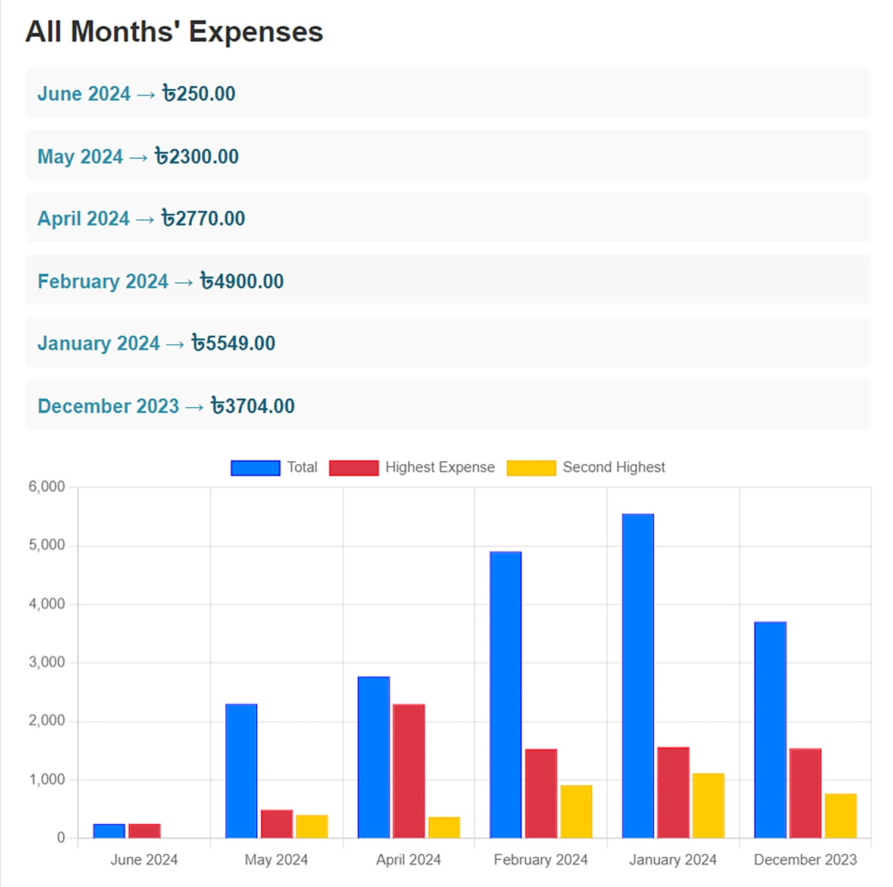
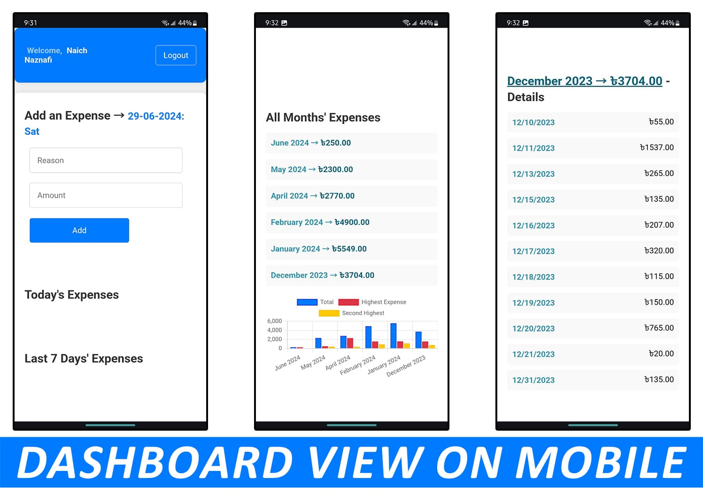

# Expense Tracker

Welcome to Expense Tracker, a web application designed to help users manage their expenses effortlessly. This project leverages Flask and PostgreSQL to provide a secure and interactive platform for tracking personal finances.

## Access the Website

You can access the Expense Tracker application for free at the following link:
***[Expense Tracker](https://expenses-tracker-6mhs.onrender.com/)***

*Home Page: Welcome to Expense Tracker, where users can easily navigate to login or register.*

## Features

- **User Authentication:** Users can create accounts, log in securely, and log out.
- **Expense Management:** Add, view, and categorize expenses effortlessly.
- **View Last 7 Days' Expenses:** Display a summary of expenses for the last 7 days.
- **View Monthly Expenses:** Display a summary of expenses for each month and view details for each date within the month.
- **Interactive Charts:** Visualize expense trends with interactive charts for better insights.
- **Responsive Design:** Optimized for desktop and mobile platforms for seamless user experience.

## Technologies Used

- **Front-end:** HTML, CSS, JavaScript
- **Back-end:** Python (Flask)
- **Database:** PostgreSQL (for demonstration purposes; can be extended to other databases)
- **Charts:** Chart.js
- **Session Management:** Flask-Session (for user session management)

## Screenshots

### Register Page

*Register Page: New users can easily register with their name, email, and password.*

### Login Page

*Login Page: Existing users can securely log in with their credentials.*

### Dashboard Overview

*Dashboard: Visual summary of expenses for the current month.*

## Detailed Expenses

| Monthly Expenses                                        | Daily Expenses Breakdown                                |
|---------------------------------------------------------|---------------------------------------------------------|
|  |      |
| *View detailed expenses for the last 6 months.*         | *View expenses for each day within the selected month.* |

### Mobile Dashboard

*Mobile Dashboard: Responsive design ensures usability across different devices.*

## Setup Instructions

To run this project locally, follow these steps:

1. Clone the repository: `git clone https://github.com/Nafi7393/Expenses-Tracker.git`
2. Navigate into the project directory: `cd Expenses-Tracker`
3. Install dependencies: `pip install -r requirements.txt`
4. Set up the PostgreSQL database:
   - Create a database named `expenses_tracker`.
   - Update the database URI in `config.py` with your PostgreSQL credentials.
5. Initialize the database: `python manage.py db upgrade`
6. Start the Flask application: `python app.py`
7. Open your web browser and visit: `http://localhost:5000`

## Usage

- Register for a new account or log in with existing credentials.
- Add expenses with details such as date, category, and amount.
- Navigate through daily, weekly, and monthly summaries on the dashboard.
- Visualize spending patterns with interactive charts.

## Contributing

Contributions are welcome! Please fork the repository and submit a pull request with your improvements.
